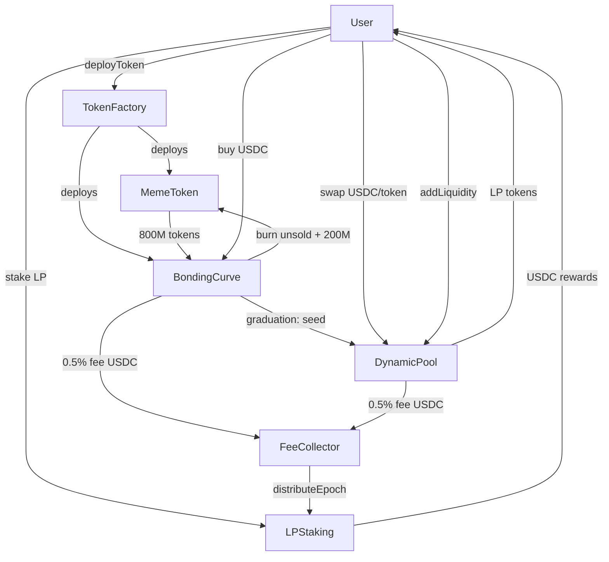
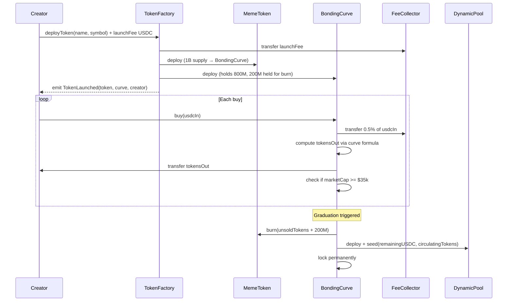
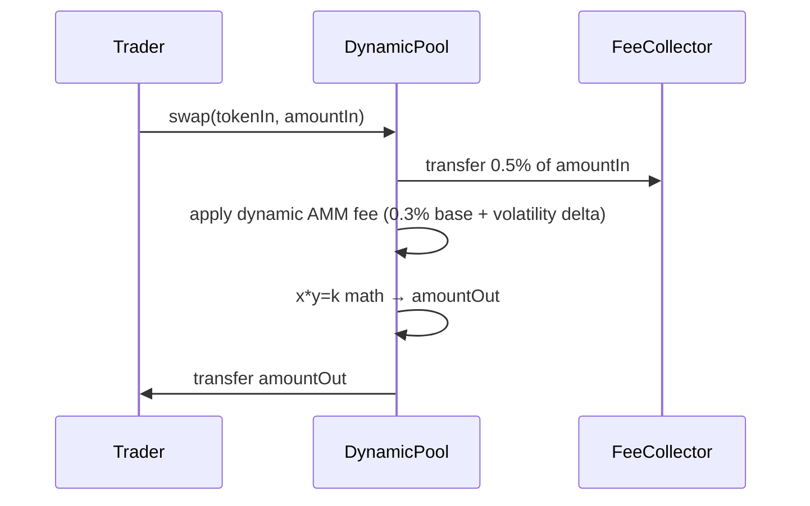
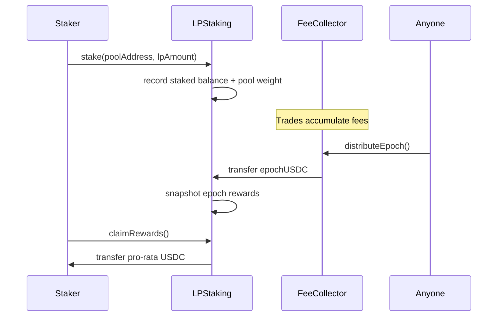

# MemeDEX — Smart Contract Design Document

**Status:** Draft  
**Authors:** Arc Studio  
**Target Chain:** Arc Testnet (chain ID 2525694648713029), EVM-compatible, Paris hardfork  
**Language/Toolchain:** Solidity 0.8.24, Foundry/Forge, OpenZeppelin 5.1.0  
**Milestone:** v1.0 — initial deploy  

### Review Tracker
- [ ] Design Review
- [ ] Security Review
- [ ] Ops Review
- [ ] Compliance Review

---

## Action Items (living)

_Empty — fill after each review round._

---

## Goals / Non-Goals

### Goals
- Anyone can launch a meme ERC-20 token with a bonding curve in one transaction.
- Bonding-curve tokens graduate automatically to a constant-product AMM pool at a $35k market-cap trigger.
- Dynamic swap fees adjust with volatility, favoring stable markets and protecting LPs during meme pumps.
- 0.5% of every trade (curve buy or AMM swap) flows to a shared fee collector.
- LP stakers earn a pro-rata share of all platform fees distributed per epoch.
- All contracts are fully immutable — no admin keys, no upgradeable proxies, no owner after deploy.
- The system is open-source and permissionless: no whitelisting, no gatekeeping.

### Non-Goals
- No governance token or DAO — parameters are fixed at deploy.
- No cross-chain bridging or CCTP in v1.
- No order book or limit-order mechanics.
- No oracle integration (price is purely on-chain from the bonding curve / AMM state).
- No front-end in this document scope.
- No fee-on-transfer or rebasing token support in pools (only standard ERC-20s).

---

## Requirements

### Functional
1. `TokenFactory.deployToken(name, symbol)` atomically deploys `MemeToken` + `BondingCurve`, charges a flat USDC launch fee, and emits `TokenLaunched`.
2. `BondingCurve.buy(usdcIn)` accepts USDC, deducts 0.5% fee to `FeeCollector`, computes tokens out via curve formula, transfers tokens to buyer.
3. `BondingCurve` checks market cap after every buy; when (current price × 800M) ≥ $35,000 USDC it triggers graduation automatically.
4. Graduation burns all unsold curve tokens + 200M reserve tokens, seeds a `DynamicPool` with remaining USDC, and permanently locks the curve.
5. `DynamicPool` is a constant-product (x·y=k) AMM. Base swap fee = 0.3%. Fee escalates with price volatility. 0.5% of each swap input is deducted before AMM math and sent to `FeeCollector`.
6. `DynamicPool` mints/burns LP tokens for liquidity adds/removes. Anyone can create a pool for any token pair.
7. `LPStaking` accepts LP tokens from any registered `DynamicPool`. Distributes accumulated `FeeCollector` USDC to stakers pro-rata each epoch.
8. `FeeCollector.distributeEpoch()` is permissionless — anyone may call it to push USDC to `LPStaking`.
9. Total supply of every `MemeToken` is fixed at 1,000,000,000 (1B) — minted once at deploy, never again.

### Security
- No path lets a non-curve contract call `MemeToken.mint` after initial deploy.
- Graduation is one-way and atomic — partial graduation must revert entirely.
- The 0.5% fee deduction happens BEFORE any curve or AMM math; it cannot be bypassed.
- LP token balances used for reward calculation must reflect actual pool share — no fake LP inflation.
- `FeeCollector` holds only USDC transiently between trades and epoch distribution — it must not accumulate indefinitely.
- No reentrancy path on any external USDC transfer.
- `DynamicPool` seeded at graduation cannot be drained by any privileged address (there is none).

---

## Terminology & Actors

| Term | Definition |
|---|---|
| Bonding Curve | A mathematical price function where token price increases as supply sold increases. |
| Graduation | The event where a bonding-curve token's market cap hits $35k, triggering AMM migration. |
| LP Token | ERC-20 token representing a share of liquidity in a `DynamicPool`. |
| Epoch | A fixed time window (e.g. 7 days) after which accumulated fees are distributed to stakers. |
| Market Cap (curve) | `currentPrice × 800,000,000` — uses the marginal price at the current supply sold. |
| Platform Fee | 0.5% of trade input USDC, collected before curve/AMM math. |
| AMM Fee | 0.3% base swap fee (post-platform-fee) retained in the pool for LPs, dynamic upward. |

| Actor | On/Off-chain | Trust Level | What they can do |
|---|---|---|---|
| Token Creator | On-chain EOA | Untrusted | Calls `TokenFactory.deployToken` — no special privileges after. |
| Trader | On-chain EOA | Untrusted | Buys on bonding curve, swaps in AMM pools. |
| Liquidity Provider | On-chain EOA | Untrusted | Adds/removes liquidity to any `DynamicPool`. |
| LP Staker | On-chain EOA | Untrusted | Stakes LP tokens in `LPStaking` to earn fee rewards. |
| Epoch Caller | On-chain EOA | Untrusted | Calls `FeeCollector.distributeEpoch()` permissionlessly. |
| `TokenFactory` deployer | Off-chain | Trusted (one-time) | Sets immutable launch fee and FeeCollector address at deploy. No ongoing control. |
| No admin | — | — | There are no privileged roles post-deploy on any contract. |

---

## Language / Runtime

- **Language:** Solidity 0.8.24 — built-in overflow checks, custom errors, `immutable`.
- **Compiler:** Locked via `foundry.toml` `solc_version = "0.8.24"`.
- **EVM hardfork:** Paris (`evm_version = "paris"` in `foundry.toml`) — Arc Testnet requirement.
- **OpenZeppelin:** 5.1.0 (pinned) — `ERC20`, `ReentrancyGuard`, `SafeERC20`. NOT 5.2.0+ (uses `mcopy` / Cancun opcodes incompatible with Paris).
- **No upgradeable proxy** — all contracts use standard deploy; no `initialize`, no `__gap`, no UUPS.

---

## Transaction & Execution Model

All state changes are atomic per transaction. If any step in graduation reverts, the entire transaction reverts — no partial state.

**Re-entrancy surface:** Every function that transfers USDC or MemeTokens is guarded with `nonReentrant` (OZ `ReentrancyGuard`). CEI (Checks-Effects-Interactions) ordering is enforced throughout:
1. Validate inputs and state.
2. Update all storage (balances, supply, pool reserves).
3. Perform external token transfers last.

USDC on Arc is a standard ERC-20 (6 decimals). All amounts in contract storage use USDC's 6-decimal integer representation.

---

## Chain Standards & Interfaces

- **MemeToken:** ERC-20 (OZ `ERC20`). Fixed supply. No permit, no votes.
- **DynamicPool LP token:** ERC-20 minted/burned by the pool itself (inherits `ERC20`).
- **USDC on Arc Testnet:** Standard ERC-20, 6 decimals. Address sourced from Arc's onchain-facts module — never hardcoded in contract source; passed as constructor arg.

---

## Architecture Overview

### Component Diagram

### Token Launch & Bonding Flow

### AMM Swap Flow

### Stake & Earn Flow

### Flow of Funds

| Step | Who moves what | Invariant |
|---|---|---|
| Launch fee paid | Creator → FeeCollector | FeeCollector.balance += launchFee |
| Bonding buy | Trader USDC → BondingCurve (net 99.5%) + FeeCollector (0.5%) | totalRaised + feesCollected = totalUSDCIn |
| Graduation seed | BondingCurve USDC → DynamicPool | Pool seeded = totalRaised (net of fees already sent) |
| AMM swap | Trader USDC → DynamicPool (99.5%) + FeeCollector (0.5%) | Pool reserves updated by full net amount |
| Epoch distribute | FeeCollector USDC → LPStaking | FeeCollector.balance resets to 0 after distribution |
| Claim rewards | LPStaking USDC → Staker | LPStaking distributes exactly what FeeCollector sent |
| Resting state | No contract holds user funds beyond its defined purpose | BondingCurve locked post-graduation; FeeCollector drained each epoch |

---

## Contract Design

### 1. MemeToken.sol

**Roles:** None post-deploy. Only `BondingCurve` (set as `burner` at deploy) can call `burn`. No minter after construction.

**Storage layout:**
| Variable | Type | Notes |
|---|---|---|
| (inherited ERC-20) | — | name, symbol, decimals, balances, allowances |
| `burner` | `address immutable` | Set to BondingCurve at deploy |

**Key functions (write):**
| Function | Caller | State mutated | Events | Reverts if |
|---|---|---|---|---|
| `constructor(name, symbol, burner)` | TokenFactory | mints 1B to BondingCurve | `Transfer(0, curve, 1B)` | burner == address(0) |
| `burn(address from, uint256 amount)` | burner only | reduces supply + balance | `Transfer(from, 0, amount)` | caller != burner OR insufficient balance |

---

### 2. BondingCurve.sol

**Roles:** None. `graduated` flag is permanent.

**Storage layout:**
| Variable | Type | Notes |
|---|---|---|
| `token` | `address immutable` | MemeToken |
| `usdc` | `address immutable` | USDC contract |
| `feeCollector` | `address immutable` | FeeCollector |
| `poolFactory` | `address immutable` | DynamicPool factory |
| `totalRaised` | `uint256` | Cumulative USDC raised (net of fees) |
| `totalSold` | `uint256` | Tokens sold off the curve |
| `graduated` | `bool` | True after graduation — permanently |
| `CURVE_SUPPLY` | `uint256 constant` | 800_000_000 × 1e18 |
| `BURN_RESERVE` | `uint256 constant` | 200_000_000 × 1e18 |
| `GRADUATION_CAP` | `uint256 constant` | 35_000 × 1e6 (USDC 6-dec) |
| `PLATFORM_FEE_BPS` | `uint16 constant` | 50 (0.5%) |

**Price formula (linear bonding curve):**
`price = BASE_PRICE + SLOPE × totalSold`  
Where `BASE_PRICE` and `SLOPE` are set such that selling all 800M tokens raises approximately the graduation target. Market cap = `price(totalSold) × CURVE_SUPPLY`.

**Key functions (write):**
| Function | Caller | State mutated | Events | Reverts if |
|---|---|---|---|---|
| `buy(uint256 usdcIn, uint256 minTokensOut)` | Anyone | totalRaised, totalSold, token balances | `Buy(buyer, usdcIn, tokensOut)` | graduated, usdcIn==0, slippage, insufficient curve supply |
| `_graduate()` | Internal (called from buy) | graduated=true, burns tokens, creates pool | `Graduated(token, pool, usdcSeeded)` | already graduated |

**Graduation sequence (atomic, single tx):**
1. Set `graduated = true` (re-entrancy guard prevents re-entry).
2. Calculate unsold tokens = `CURVE_SUPPLY - totalSold`.
3. Call `token.burn(address(this), unsold + BURN_RESERVE)`.
4. Approve `totalRaised` USDC to new DynamicPool.
5. Call `poolFactory.createPool(token, usdc, totalRaised, circulatingTokens)`.
6. Emit `Graduated`.

---

### 3. DynamicPool.sol (+ PoolFactory)

**Roles:** None. Fully permissionless.

**Storage layout (per pool):**
| Variable | Type | Notes |
|---|---|---|
| `token0`, `token1` | `address immutable` | Sorted by address for determinism |
| `usdc` | `address immutable` | For fee routing logic |
| `feeCollector` | `address immutable` | |
| `reserve0`, `reserve1` | `uint128` | Current reserves |
| `totalSupply` | `uint256` | LP token supply (inherited ERC-20) |
| `lastPrice0` | `uint256` | For volatility tracking |
| `priceUpdateTime` | `uint64` | Timestamp of last price update |
| `BASE_FEE_BPS` | `uint16 constant` | 30 (0.3%) |
| `MAX_FEE_BPS` | `uint16 constant` | 100 (1.0%) |
| `PLATFORM_FEE_BPS` | `uint16 constant` | 50 (0.5%) |

**Dynamic fee formula:**
`fee = BASE_FEE + min(volatilityDelta, MAX_FEE - BASE_FEE)`  
`volatilityDelta = abs(currentPrice - lastPrice) / lastPrice × VOLATILITY_MULTIPLIER`

**Key functions (write):**
| Function | Caller | State mutated | Events | Reverts if |
|---|---|---|---|---|
| `addLiquidity(amount0, amount1, minLP)` | Anyone | reserves, LP supply | `LiquidityAdded` | slippage, zero amounts |
| `removeLiquidity(lpAmount, min0, min1)` | LP holder | reserves, LP supply | `LiquidityRemoved` | insufficient LP, slippage |
| `swap(tokenIn, amountIn, minOut, deadline)` | Anyone | reserves, lastPrice | `Swap` | expired, slippage, zero |
| `createPool` (PoolFactory) | Anyone / BondingCurve | deploys new DynamicPool | `PoolCreated` | pool exists for pair |

---

### 4. LPStaking.sol

**Roles:** None. Permissionless.

**Storage layout:**
| Variable | Type | Notes |
|---|---|---|
| `usdc` | `address immutable` | Reward token |
| `feeCollector` | `address immutable` | Only source of reward USDC |
| `epochDuration` | `uint64 immutable` | e.g. 7 days in seconds |
| `epochStart` | `uint64` | Timestamp of current epoch start |
| `epochRewards` | `uint256` | USDC received this epoch |
| `totalStaked[pool]` | `mapping(address => uint256)` | Total LP staked per pool |
| `userStaked[pool][user]` | `mapping(address => mapping(address => uint256))` | Per-user LP staked |
| `rewardDebt[pool][user]` | `mapping(...)` | For reward accounting (accumulator pattern) |
| `accRewardPerShare[pool]` | `mapping(address => uint256)` | Accumulated reward per LP share |

**Reward accounting:** Uses the standard MasterChef accumulator pattern to avoid O(n) loops.

**Key functions (write):**
| Function | Caller | State mutated | Events | Reverts if |
|---|---|---|---|---|
| `stake(pool, lpAmount)` | LP holder | userStaked, totalStaked | `Staked` | invalid pool, zero amount |
| `unstake(pool, lpAmount)` | LP holder | userStaked, totalStaked | `Unstaked` | insufficient staked |
| `claimRewards(pool)` | Staker | rewardDebt | `RewardClaimed` | nothing to claim |
| `receiveEpochRewards(uint256 usdc)` | FeeCollector only | epochRewards, accRewardPerShare | `EpochRewards` | caller != feeCollector |

---

### 5. FeeCollector.sol

**Roles:** None post-deploy. `lPStaking` address is immutable.

**Storage layout:**
| Variable | Type | Notes |
|---|---|---|
| `usdc` | `address immutable` | |
| `lpStaking` | `address immutable` | |
| `epochDuration` | `uint64 immutable` | Must match LPStaking |
| `lastDistribution` | `uint64` | Timestamp of last distributeEpoch |
| `pendingFees` | `uint256` | Accumulated USDC since last distribution |

**Key functions (write):**
| Function | Caller | State mutated | Events | Reverts if |
|---|---|---|---|---|
| `receiveFee(uint256 amount)` | BondingCurve / DynamicPool | pendingFees | `FeeReceived` | amount == 0 |
| `distributeEpoch()` | Anyone | pendingFees=0, lastDistribution | `EpochDistributed` | epoch not ended |

---

### 6. TokenFactory.sol

**Storage layout:**
| Variable | Type | Notes |
|---|---|---|
| `usdc` | `address immutable` | |
| `feeCollector` | `address immutable` | |
| `poolFactory` | `address immutable` | |
| `launchFee` | `uint256 immutable` | USDC (6-dec) charged per launch |

**Key functions (write):**
| Function | Caller | State mutated | Events | Reverts if |
|---|---|---|---|---|
| `deployToken(name, symbol)` | Anyone | deploys MemeToken + BondingCurve | `TokenLaunched` | USDC launchFee not approved/transferred |

---

## Deployment & Initialization

**Deploy order (all immutable — no init functions):**
1. Deploy `FeeCollector(usdc, lpStaking_placeholder, epochDuration)` — NOTE: circular dependency with LPStaking. Resolve with a two-step pattern: deploy FeeCollector with a temporary address, then deploy LPStaking, then deploy FeeCollector2 with real LPStaking address, or use a factory pattern that sets both atomically.

**Recommended deploy order to break circular dependency:**
1. Deploy `LPStaking` with placeholder FeeCollector = address(0) initially — OR use a deploy factory.
2. Deploy `FeeCollector(usdc, lpStaking, epochDuration)`.
3. Deploy `PoolFactory(usdc, feeCollector)`.
4. Deploy `TokenFactory(usdc, feeCollector, poolFactory, launchFee)`.

To break the circular LPStaking ↔ FeeCollector dependency cleanly: `LPStaking` should accept fees from `feeCollector` address verified at call-time (immutable set at deploy). Deploy `LPStaking` first (it only needs to know `feeCollector`'s future address if we use CREATE2 for deterministic addressing) then `FeeCollector`.

**Alternative (recommended):** Use a `DEXDeployer` script that computes all CREATE2 addresses upfront and deploys in one atomic script call.

**Constructor args at deploy:**
- `launchFee`: e.g. 1 USDC = 1_000_000 (6 decimals)
- `epochDuration`: 604800 (7 days)
- `USDC address`: Arc Testnet USDC

---

## Upgradeability

All contracts are **fully immutable**. No proxy, no admin. Migration path for v2: deploy new contracts at new addresses, announce new factory address. Old pools continue to function indefinitely. Users migrate liquidity voluntarily.

---

## Key Management & Signing

No ongoing key management post-deploy. Deploy scripts run from a hot deployer wallet (EOA). After deploy, that wallet has zero privileges. No EIP-712 signatures in v1.

---

## Security Considerations

| Vulnerability | Applicable? | Mitigation |
|---|---|---|
| Reentrancy | Yes — USDC transfers on every path | CEI ordering + `nonReentrant` on all buy/swap/stake/distribute functions |
| Access control | Minimal — only MemeToken.burn restricted to BondingCurve | `immutable burner`; checked with `require(msg.sender == burner)` |
| Integer overflow/underflow | Solidity 0.8.24 | Auto-checked. No `unchecked` blocks except where division truncation is documented |
| Unchecked external call | Yes — USDC and token transfers | `SafeERC20.safeTransfer` / `safeTransferFrom` throughout |
| Fee-on-transfer / rebasing tokens | No — only standard MemeToken + USDC | Explicit: pool only accepts standard ERC-20s; balance-delta check on adds |
| Signature replay | No signatures in v1 | N/A |
| Front-running / MEV | Yes — bonding curve buys, AMM swaps | `minOut` / `minTokensOut` slippage param on all trades; deadline on swaps |
| Flash-loan / price manipulation | Yes — AMM price used for volatility calc | Volatility measured over time window, not single-block; graduation uses bonding curve price (internal), not AMM |
| Oracle manipulation | No external oracle | Price is internal to curve/AMM — no Chainlink or spot-price trust |
| Denial of service | Yes — distributeEpoch could be front-run | Anyone can call it; no harm from early call (epoch guard); MasterChef pattern avoids loops |
| Timestamp dependence | Yes — epoch timing | Acceptable: epoch boundary is economic (rewards), not security-critical; 15s miner manipulation tolerance is acceptable for 7-day epochs |
| Approval persistence | Yes — USDC approvals | Exact-amount approvals; no max-approval pattern in contract code |
| Centralization risk | Minimal — no admin | Only deploy-time: deployer sets immutable params. After deploy: zero control. Documented. |
| Graduation atomicity | Critical | `graduated` flag set first; full revert if burn or pool seed fails |
| LP inflation attack | Yes — first depositor | Minimum liquidity lock (e.g. 1000 LP units burned to address(0)) on first `addLiquidity` |
| Circular dependency DoS | Yes — FeeCollector ↔ LPStaking | Broken by deploy order; LPStaking validates `msg.sender == feeCollector` immutably |

---

## Trust Model & Threat Analysis

| Actor | Max damage if compromised | Mitigation | Detection |
|---|---|---|---|
| Deployer EOA | Can set wrong immutable params (wrong USDC address, wrong fee, wrong epoch) | Verify all constructor args on-chain before public announcement; no ongoing power | One-time deploy tx — publicly verifiable |
| Trader | Can buy/sell legitimately; cannot steal funds | Slippage guards; no privileged access | Standard AMM protections |
| MEV bot | Can sandwich bonding curve buys | `minTokensOut` param; users should set reasonable slippage | Accepted in AMM design |
| Malicious token creator | Deploys a token with a manipulated name/symbol | MemeToken is standard ERC-20; no backdoor; BondingCurve holds funds, not creator | TokenLaunched event; UI can filter |
| Re-entrant USDC | USDC callback via ERC-777-style hook | USDC on Arc is standard ERC-20 (no hooks); CEI + nonReentrant as defense-in-depth | N/A for Arc USDC |

---

## Emergency Response & Circuit Breakers

**There are no pause functions** — the system is fully immutable by design. This is a deliberate tradeoff: the goal is a fully trustless, open-source platform with no admin keys.

**Consequence:** A critical bug cannot be patched in deployed contracts. Mitigation:
- Full security review (max severity) before deploy.
- Forge unit tests + fork integration tests.
- Graduated deployment: start with a low `launchFee` and monitor for 30 days.
- New `TokenFactory` can be deployed at any time pointing to fixed contracts. Old factory still works.

---

## Failure Scenarios

1. **Graduation buy reverts mid-way:** `nonReentrant` + CEI ensures all-or-nothing. If the DynamicPool deploy fails, the entire buy tx reverts; BondingCurve state is unchanged; user keeps their USDC.
2. **FeeCollector not called for many epochs:** `pendingFees` accumulates indefinitely until anyone calls `distributeEpoch`. No funds are lost; rewards are delayed, not stolen.
3. **All LP stakers unstake before epoch:** `totalStaked = 0`; `distributeEpoch` sends rewards to LPStaking anyway. Rewards accumulate in LPStaking and are claimable by future stakers — OR, LPStaking can hold a "residual" balance that rolls into the next epoch (implementation choice — document in contract NatSpec).
4. **Token with very slow bonding curve:** Market cap never hits $35k. Token stays on the curve indefinitely. Liquidity never migrates to AMM. This is by design — graduation is not guaranteed.

---

## Priorities & Tradeoffs

| Decision | Tradeoff | Rationale |
|---|---|---|
| Fully immutable (no admin keys) | No emergency pause; bugs are permanent | Open-source, trustless ethos; avoids pump.fun-style rug risk |
| 0.5% fee taken before AMM math | Slightly less liquidity depth | Simple, auditable; fee cannot be skipped or sandwich-exploited via routing |
| Linear bonding curve | Less capital-efficient than polynomial; predictable graduation price | Simpler math, easier to audit and understand for users |
| MasterChef accumulator for staking | Complexity vs. O(n) loop | O(n) loops are unbounded DoS; accumulator is standard and gas-efficient |
| Separate FeeCollector contract | More contracts, more deploy cost | Clean separation; FeeCollector can be re-used in v2 without changing staking logic |
| 7-day epoch | Rewards lag real-time; less gas than per-trade | Per-trade distribution would be prohibitively expensive for small stakers |

**Rejected alternatives:**
- Concentrated liquidity (Uniswap v3 style): too complex for initial meme-coin use case; constant-product is sufficient.
- Governance token: rejected to maintain immutability guarantee.
- Polynomial bonding curve: more capital-efficient but harder to reason about graduation price — linear chosen for auditability.

---

## Testing Strategy

- **Unit tests (Forge):** 100% branch coverage target on all write functions. Fuzz `buy(usdcIn)` for price consistency. Invariant test: `totalSupply(token) == 1B - burned`. Fuzz `swap` for x·y=k preservation.
- **Integration tests:** Full launch → buy → graduate → swap → stake → earn flow on Arc Testnet fork.
- **Static analysis:** Slither on all contracts; resolve all High and Medium findings.
- **Manual review:** Security review at max severity before deploy.

Run full suite: `forge test --gas-report`

---

## Third-Party Libraries

| Library | Version | Dependency? | Why | Reviewed? |
|---|---|---|---|---|
| OpenZeppelin Contracts | 5.1.0 | Yes (pinned) | ERC20, ReentrancyGuard, SafeERC20 | Yes — industry standard |

---

## Monitoring & Alerting

| Event | Threshold | Severity | Action |
|---|---|---|---|
| `Graduated(token, pool, usdc)` | Any | Info | Index for analytics; verify pool seeded correctly |
| `TokenLaunched` | Any | Info | Index for token discovery UI |
| `EpochDistributed(amount)` | amount == 0 | Warning | No fees collected — may indicate low activity |
| `Swap` slippage extreme | price impact > 20% | Warning | Possible manipulation attempt |
| FeeCollector.pendingFees | > 30 days without distribution | Warning | Call `distributeEpoch` |
